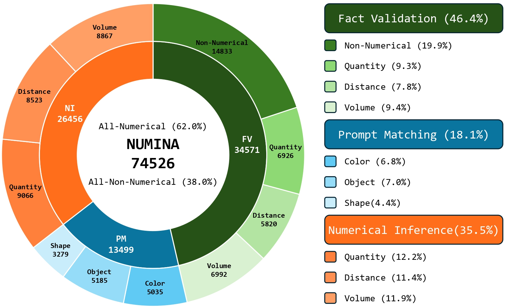

# NUMINA: A Natural Understanding Benchmark for Multi-dimensional Intelligence and Numerical Reasoning

> We introduce **NUMINA**, the first benchmark focusing on multi-dimensional intelligence and fine-grained numerical reasoning in 3D multimodal environments.


## 📝 Abstract
Recent advancements in 2D multimodal large language models (MLLMs) have significantly improved performance in vision-language tasks. However, extending these capabilities to 3D environments remains distinct challenges due to the complexity of spatial reasoning. Nevertheless, existing 3D benchmarks often lack fine-grained numerical reasoning task annotations, limiting MLLMs' ability to perform precise spatial measurements and complex numerical reasoning. To address this gap, we introduce **NUMINA**, the first **N**atural **U**nderstanding benchmark for **M**ulti-dimensional **I**ntelligence and **N**umerical reasoning **A**bilities to enhance multimodal indoor perceptual understanding. **NUMINA** features multi-scale annotations and various question-answer pairs, generated using **NUMINA-Flow**, an automated annotation pipeline that integrates LLM rewriting and rule-based self-verification. We evaluate the performance of various state-of-the-art LLMs on **NUMINA** following the Chat-Scene framework, demonstrating that current LLMs struggle with multimodal numerical reasoning, particularly in performing precise computations such as distance and volume estimation, highlighting the need for further advancements in 3D models.

<p align="center">
  
</p>

---

## 📰 News
- **2025.09** Code released. Reproducible baselines available with unified evaluation.  
- **2025.07** Our paper *NUMINA: A Natural Understanding Benchmark for Multi-dimensional Intelligence and Numerical Reasoning Abilities* was accepted at *Findings of EMNLP 2025*.

---

## 🔍 Overview

**NUMINA** is a new 3D vision-language benchmark designed to evaluate **fine-grained spatial understanding and numerical reasoning**.  
- **Tasks**: Fact Validation (Yes/No), Prompt Matching (Multiple-choice), Numerical Inference (Value-output).  
- **Dataset**: 74,526 QA pairs covering numerical and non-numerical reasoning.  
- **Pipeline**: Built with **NUMINA-Flow**, which integrates LLM rewriting, numerical ground truth extraction, and rule-based verification.  
- **Baselines**: Evaluated under the **Chat-Scene framework**.

---

## ⚙️ Installation

```bash
# Clone the repo
git clone https://github.com/fengshun124/NUMINA.git
cd NUMINA

# Create environment
conda create -n numina python=3.10 -y
conda activate numina

# Install dependencies
pip install -r benchmark/requirements.txt
```

---

## 🔨 Preparation

- Please download the used LLM backbones (e.g. [Vicuna](https://huggingface.co/lmsys/vicuna-7b-v1.5), [Phi](https://huggingface.co/microsoft/phi-4), [Mistral](https://huggingface.co/mistralai/Mistral-7B-Instruct-v0.3), [Qwen](https://huggingface.co/Qwen/Qwen2.5-7B-Instruct)) in [HuggingFace](https://huggingface.co/).
- Change the "llama_model_path" in [run_numina.sh](benchmark/scripts/run_numina.sh) to the path of downloaded LLM path.
---

## 🧠 Training & Evaluation

```bash
python benchmark/scripts/run_numina.sh
```

---

## 📜 Citation

If you use NUMINA, please cite our paper:

```bibtex
@inproceedings{numina-emnlp-findings-2025,
  title   = {NUMINA: A Natural Understanding Benchmark for Multi-dimensional Intelligence and Numerical Reasoning Abilities},
  author  = {Changyu Zeng, Yifan Wang, Zimu Wang, Wei Wang, Zhengni Yang, Muyi Bao, Jiming Xiao, Ahn Nguyen, Yutao Yue},
  booktitle = {Findings of the Association for Computational Linguistics: EMNLP 2025},
  year    = {2025}
}
```

---

## 🙏 Acknowledgements

NUMINA builds on open-source contributions including:
- LLMs:  [Vicuna](https://huggingface.co/lmsys/vicuna-7b-v1.5), [Phi](https://huggingface.co/microsoft/phi-4), [Mistral](https://huggingface.co/mistralai/Mistral-7B-Instruct-v0.3), [Qwen](https://huggingface.co/Qwen/Qwen2.5-7B-Instruct)
- Detectors: [PointGroup](https://github.com/dvlab-research/PointGroup), [Mask3D](https://github.com/JonasSchult/Mask3D), [DEVA](https://github.com/hkchengrex/Tracking-Anything-with-DEVA)
- Representations: [ULIP](https://github.com/salesforce/ULIP), [Uni3D](https://github.com/baaivision/Uni3D), [DINOv2](https://github.com/facebookresearch/dinov2)
- 3D Models: [vil3dref](https://github.com/cshizhe/vil3dref), [OpenScene](https://github.com/pengsongyou/openscene)
- Framework: [Chat-Scene](https://github.com/ZzZZCHS/Chat-Scene)
